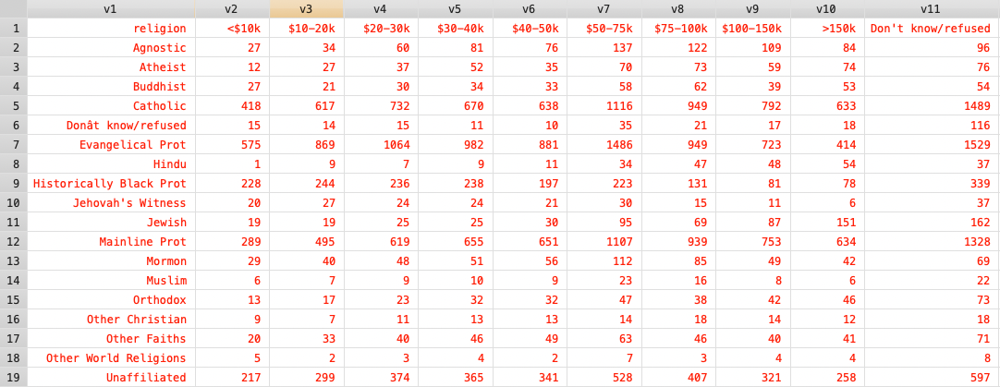
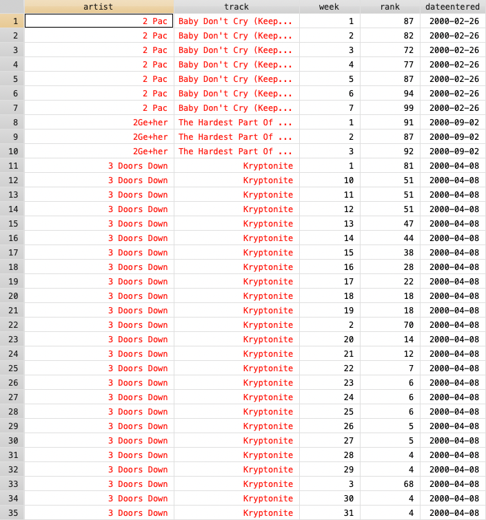

```{r setup, include=FALSE}
knitr::opts_chunk$set(echo = TRUE,
                      dpi = 400,
                      warning = FALSE,
                      message = FALSE,
                      fig.align = 'center',
                      comment = "#>")
```

在上次的课程 「Stata 数据管理」中我们学习了如何使用 Stata 进行数据转换，主要是 reshape、gather 和 spread 三个命令的使用。为了让大家一次性掌握各种数据转换，我准备了这个专题课程，这次课程中我们将对比学习 R 语言和 Stata 中的数据转换。

R 语言我们主要是以 gather/spread 和 pivot_longer/pivot_wider，Stata 我们主要使用 gather/spread 命令（我在课程附件中准备了 tidy 安装包，可以使用 net install 安装）。因为 Stata 的 reshape long 和 reshape wide 看起来很强大，实际上对数据的规范程度要求较多，使用起来并不方便，所以我就不再推荐使用了。

## 宽数据转长数据

### 列名为字符串

#### 使用 R 语言

这是一份宽数据：

```{r}
library(tidyverse)
read_csv('relig_income.csv') -> relig_income
relig_income
```

这个数据展示了各种信仰群体不同收入层次的人数分布。我们可以使用 tidyr 包的 gather() 或者 pivot_longer() 函数将它转换成长数据：

使用 gather()：

```{r}
relig_income %>% 
  gather(!religion, key = "income", value = "count")
```

或者：

```{r}
relig_income %>% 
  gather(2:ncol(.), key = "income", value = "count")
```

使用 pivot_longer()：

```{r}
relig_income %>% 
  pivot_longer(!religion, names_to = "income", values_to = "count")
```

或者：

```{r}
relig_income %>% 
  pivot_longer(2:ncol(.), names_to = "income", values_to = "count")
```

#### 使用 Stata

我们先读取这个文件：

```stata
clear all
import delimited using relig_income.csv, clear varnames(nonames)
```



因为 Stata 的变量要求比较多，所以不能直接设置第一行数据作为变量名，如果调整起来太麻烦了，所以我们就不折腾这个了，使用下面这样的方法更好：

```stata
clear all
import delimited using relig_income.csv, clear varnames(nonames)
* 直接 gather
gather v2-v11
keep if v1 == "religion"
drop v1
ren value income
save varnames, replace 

* 再次导入 relig_income.csv
import delimited using relig_income.csv, clear varnames(nonames)
gather v2-v11
merge m:1 variable using varnames
ren v1 religion
drop variable
ren value count
drop _m
drop if religion == "religion"
destring, replace 
order religion income count
```

### 列名中含有数值

#### 使用 R 语言

例如这份数据：

```{r}
read_csv('billboard.csv') -> billboard
billboard
```

这份数据从第四列开始，列名都是 wk + 数字的格式，我们也可以使用 gather() 或者 pivot_longer() 函数将其转为长数据：

使用 gather()：

```{r}
billboard %>% 
  gather(starts_with("wk"), key = "week", value = "rank", na.rm = T)
```

使用 pivot_longer()：

```{r}
billboard %>% 
  pivot_longer(
    cols = starts_with("wk"), 
    names_to = "week", 
    values_to = "rank",
    values_drop_na = TRUE
  )
```

另外我们也注意到 week 变量的值实际上仅保留数字即可，pivot_longer() 函数可以直接实现：

```{r}
billboard %>% 
  pivot_longer(
    cols = starts_with("wk"), 
    names_to = "week", 
    names_prefix = "wk",
    names_transform = list(week = as.integer),
    values_to = "rank",
    values_drop_na = TRUE,
  )
```

或者这样也可以：

```{r}
billboard %>% 
  pivot_longer(
    cols = starts_with("wk"), 
    names_to = "week", 
    names_transform = list(week = readr::parse_number),
    values_to = "rank",
    values_drop_na = TRUE,
  )
```

如果你使用 gather() 函数则需要再增加一步：

```{r}
billboard %>% 
  gather(starts_with("wk"), key = "week", value = "rank", na.rm = T) %>% 
  mutate(week = str_remove_all(week, "wk"),
         week = as.integer(week))
```

#### 使用 Stata 

同样，我们还是先使用 import delimited 读取：

```stata
import delimited using billboard.csv, clear
tostring _all, replace 
gather wk*
ren variable week
ren value rank
replace week = subinstr(week, "wk", "", .)
drop if rank == "NA"
destring _all, replace 
gen date = date(dateentered, "YMD")
format date %tdCY-N-D
drop dateentered
ren date dateentered
```

结果：



### 列名中包含多个变数

例如 who 数据：

```{r}
read_csv('who.csv') -> who
who
```

这是个宽数据，它的变量名包含三个变数，`new_*_**`，对于这样的数据集我们可以这样：

```{r}
who %>% pivot_longer(
  cols = new_sp_m014:newrel_f65,
  names_to = c("diagnosis", "gender", "age"), 
  names_pattern = "new_?(.*)_(.)(.*)",
  values_to = "count",
  values_drop_na = TRUE
)
```

这个正则表达式很简单：需要注意这几个限定符的区别：

字符 |	描述
:-:|:-:
* |	匹配前面的子表达式零次或多次。例如，zo* 能匹配 "z" 以及 "zoo"。* 等价于{0,}。
+ |	匹配前面的子表达式一次或多次。例如，'zo+' 能匹配 "zo" 以及 "zoo"，但不能匹配 "z"。+ 等价于 {1,}。
? |	匹配前面的子表达式零次或一次。例如，"do(es)?" 可以匹配 "do" 、 "does" 中的 "does" 、 "doxy" 中的 "do" 。? 等价于 {0,1}。
{n} |	n 是一个非负整数。匹配确定的 n 次。例如，'o{2}' 不能匹配 "Bob" 中的 'o'，但是能匹配 "food" 中的两个 o。
{n,} |	n 是一个非负整数。至少匹配n 次。例如，'o{2,}' 不能匹配 "Bob" 中的 'o'，但能匹配 "foooood" 中的所有 o。'o{1,}' 等价于 'o+'。'o{0,}' 则等价于 'o*'。
{n,m} |	m 和 n 均为非负整数，其中n <= m。最少匹配 n 次且最多匹配 m 次。例如，"o{1,3}" 将匹配 "fooooood" 中的前三个 o。'o{0,1}' 等价于 'o?'。请注意在逗号和两个数之间不能有空格。

关于正则表达式的详细使用方法大家可以参考这个：https://www.runoob.com/regexp/regexp-syntax.html 不过常用的正则表达式没几个，大家也可以遇到一个记一个。

使用 pivot_longer() 函数的 names_transform 参数可以实现转换后的变量类型转换：

```{r}
who %>% pivot_longer(
  cols = new_sp_m014:newrel_f65,
  names_to = c("diagnosis", "gender", "age"), 
  names_pattern = "new_?(.*)_(.)(.*)",
  names_transform = list(
    gender = ~ readr::parse_factor(.x, levels = c("f", "m")),
    age = ~ readr::parse_factor(
      .x,
      levels = c("014", "1524", "2534", "3544", "4554", "5564", "65"), 
      ordered = TRUE
    )
  ),
  values_to = "count",
  values_drop_na = TRUE
)
```

大家可以注意到，这个 pivot_* 函数的功能好多，越来越复杂了，所以这也是我不推荐使用的原因（我平常主要用 gather 和 spread），这是因为功能越多的函数记忆起来越困难，如果实在懒得记忆，不如把简单的函数灵活组合使用，例如上面的代码使用 gather 也可以实现：

```{r}
who %>% 
  gather(new_sp_m014:newrel_f65, key = "var", value = "count") %>% 
  mutate(diagnosis = str_match(var, "new_?(.*)_(.)(.*)")[,2],
           gender = str_match(var, "new_?(.*)_(.)(.*)")[,3],
           age = str_match(var, "new_?(.*)_(.)(.*)")[,4]) %>% 
  select(-var) %>% 
  subset(!is.na(count))
```

#### 使用 Stata

使用 Stata 的 gather 命令同样可以完成这个操作：

```stata
import delimited using who.csv, clear 
gather new*
drop if value == "NA"
gen diagnosis = ustrregexs(1) if ustrregexm(var, "new_?(.*)_(.)(.*)")
gen gender = ustrregexs(2) if ustrregexm(var, "new_?(.*)_(.)(.*)")
gen age = ustrregexs(3) if ustrregexm(var, "new_?(.*)_(.)(.*)")
drop var
ren val count
```

### 每行包含多种观测值

例如我们看这个数据：

```{r}
read_csv('family.csv') -> family
family
```

这个数据框的三四列是孩子的出生日期，五六列是孩子的性别，我们如何将这个数据框转成长数据呢？

```{r}
family %>% 
  pivot_longer(
    !family, 
    names_to = c(".value", "child"), 
    names_sep = "_", 
    values_drop_na = TRUE
  )
```

有点绕了，我们再用 gather() 函数试试：

```{r}
family %>% 
  gather(!family, key = "key", value = "val") %>% 
  separate(key, into = c("key1", "child"), sep = "_") %>% 
  spread(key1, val) %>% 
  dplyr::filter(!is.na(gender)) %>% 
  mutate(dob = lubridate::as_date(dob))
```

这样就可以了。

我们再看一下另外一个案例：

```{r}
read_csv('anscombe.csv') -> anscombe
anscombe
```

这个数据框包含两类变量，可以这样转换成长数据：

```{r}
anscombe %>% 
  pivot_longer(everything(), 
    names_to = c(".value", "set"), 
    names_pattern = "(.)(.)"
  ) %>% 
  arrange(set, x, y)
```

使用 gather 函数可以这样：

```{r}
anscombe %>% 
  mutate(id = row.names(.)) %>% 
  gather(!id, key = "key", value = "val") %>% 
  mutate(var = str_match(key, "(.)(.)")[,2],
         set = str_match(key, "(.)(.)")[,3]) %>% 
  select(-key) %>% 
  spread(var, val) %>% 
  arrange(set, x, y) %>% 
  select(-id)
```

再看这个例子：

```{r}
read_csv('pnl.csv') -> pnl
pnl
```

转换成长数据：

```{r}
pnl %>% 
  pivot_longer(
    !c(x, a, b), 
    names_to = c(".value", "time"), 
    names_pattern = "(.)(.)"
  )
```

使用 gather 函数也不复杂：

```{r}
pnl %>% 
  gather(!c(x, a, b), key = "key", value = "val") %>% 
  mutate(var = str_match(key, "(.)(.)")[,2],
         time = str_match(key, "(.)(.)")[,3]) %>% 
  select(-key) %>% 
  spread(var, val)
```

#### 使用 Stata 

我们再用 Stata 完成上面的几个例子：

1. family.csv

```stata
import delimited using family.csv, clear 
tostring _all, replace 
gather *_*
split var, parse(_)
keep family val variable1 variable2
ren variable2 child
spread var val
drop if gender == "NA"
destring, replace 
gen date = date(dob, "YMD")
format date %tdCY-N-D
drop dob
ren date dob
```

2. anscombe.csv

```stata
import delimited using anscombe.csv, clear
gen id = _n
gather x* y*
gen var = substr(variable, 1, 1)
gen set = substr(variable, 2, 2)
drop variable
spread var val
drop id
destring, replace 
```

3. pnl.csv

```stata
import delimited using pnl.csv, clear
gather y* z*
gen var = substr(variable, 1, 1)
gen timer = substr(variable, 2, 2)
spread var val
drop var
destring, replace 
```

## 长数据转换成宽数据

例如 fish_encounters 数据：

```{r}
read_csv('fish_encounters.csv') -> fish_encounters
fish_encounters
```

使用 pivot_wider 可以很方便的将它转换成宽数据：

```{r}
fish_encounters %>% 
  pivot_wider(
    names_from = station, 
    values_from = seen,
    values_fill = 0
  )
```

使用 spread 命令也可以：

```{r}
fish_encounters %>% 
  spread(station, seen, fill = 0)
```

使用 Stata 也可以轻松完成上面的操作：

```stata
import delimited using fish_encounters.csv, clear
spread station seen
mvencode BCE - Rstr, mv(. = 0)
```

### 数据透视：加总

pivot_wider 可以在长宽转换的同时还可以进行简单的加总运行，例如：

```{r} 
read_csv('warpbreaks.csv') -> warpbreaks
warpbreaks
```

生成数据透视表：

```{r}
warpbreaks %>% 
  pivot_wider(
    names_from = wool, 
    values_from = breaks,
    values_fn = list(breaks = mean)
  )
```

这样我们就可以看到每种 wool 和 tension 的 breaks 的均值了。

使用 summarise 函数和 spread 函数也可以实现：

```{r} 
warpbreaks %>% 
  group_by(wool, tension) %>% 
  summarise(breaks = mean(breaks, na.rm = T)) %>% 
  spread(wool, breaks)
```

#### 使用 Stata 完成

```stata
import delimited using warpbreaks.csv, clear
collapse breaks, by(wool tension)
spread wool breaks
```

### 从多个变量生成列名

例如这个数据：

```{r}
read_csv('production.csv') -> production
production
```

我们想把 product 和 country 变量组合起来转换成宽数据：

```{r}
production %>% pivot_wider(
  names_from = c(product, country), 
  values_from = production
)
```

```{r}
production %>% pivot_wider(
  names_from = c(product, country), 
  values_from = production,
  names_sep = ".",
  names_prefix = "prod."
)
```

```{r}
production %>% pivot_wider(
  names_from = c(product, country), 
  values_from = production,
  names_glue = "prod_{product}_{country}"
)
```

使用 spread 函数也可以：

```{r}
production %>% 
  unite("var", product:country, sep = "_", remove = T) %>% 
  spread(var, production)
```

### 使用 Stata

```stata
import delimited using production.csv, clear
unite product country, gen(var) sep(_)
drop product country
spread var production
```

---

<h5 align="center">©微信公众号 RStata</h5>
